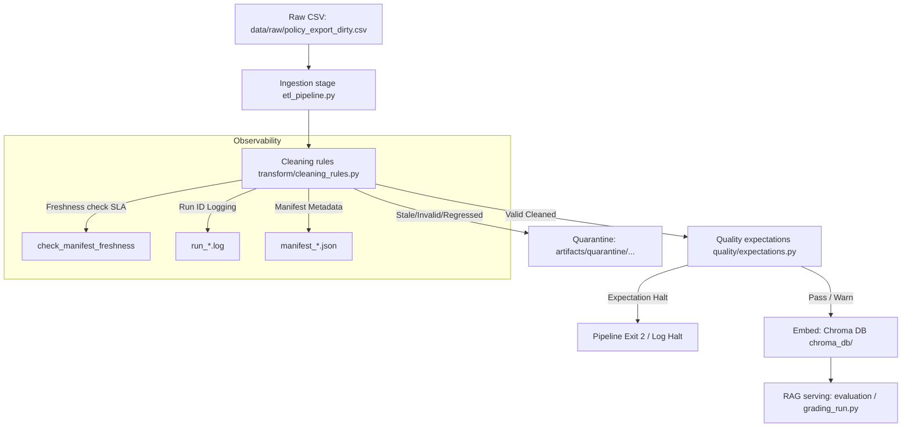

# Kiến trúc pipeline — Lab Day 10

**Nhóm:** AI-Action-Group-1  
**Cập nhật:** 2026-06-10

---

## 1. Sơ đồ luồng

---

## 2. Ranh giới trách nhiệm

| Thành phần | Input | Output | Owner nhóm |
|------------|-------|--------|--------------|
| Ingest | File CSV thô | Danh sách các dòng raw | Ingestion Owner |
| Transform | Danh sách các dòng raw | Dòng sạch (Cleaned) + Dòng cách ly (Quarantine) | Cleaning Owner |
| Quality | Dòng sạch sau clean | Trạng thái Pass/Fail của expectations | Quality Owner |
| Embed | File cleaned CSV | Upsert vector vào ChromaDB collection | Embed Owner |
| Monitor | File Manifest JSON | SLA freshness status (PASS/WARN/FAIL) | Monitor Owner |

---

## 3. Idempotency & rerun

*   **Định danh ổn định (Stable Chunk ID):** Mỗi chunk được gán một `chunk_id` dạng hash duy nhất thông qua hàm `_stable_chunk_id(doc_id, fixed_text, seq)`.
*   **Chiến lược Upsert:** ChromaDB sử dụng cơ chế `upsert` theo `chunk_id`. Nếu chạy lại pipeline nhiều lần với cùng một dữ liệu, ChromaDB sẽ cập nhật đè lên bản ghi cũ chứ không tạo bản ghi mới (tránh phình dung lượng).
*   **Pruning (Dọn dẹp vector cũ):** Ở cuối bước embed, pipeline so sánh tập ID hiện tại với các ID cũ có trong collection. Các ID cũ không còn xuất hiện trong cleaned run này sẽ bị xóa bỏ hoàn toàn (`col.delete()`) để loại bỏ hoàn toàn "rác dữ liệu" trước khi serving.

---

## 4. Liên hệ Day 09

*   Pipeline này đóng vai trò là tầng chuẩn bị dữ liệu (Data Ingestion Layer) cho hệ thống Multi-agent ở Day 09.
*   Dữ liệu sau khi đi qua pipeline này sẽ được lưu tại collection `day10_kb` trong thư mục `chroma_db/`. Các RAG agent ở Day 09 chỉ cần kết nối và truy vấn collection này để đảm bảo câu trả lời luôn khớp với các chính sách hiện hành nhất mà không bị nhiễu bởi các tài liệu nháp cũ hay phiên bản lỗi.

---

## 5. Rủi ro đã biết

*   **Dịch vụ mạng tải model:** Lần đầu SentenceTransformers hoạt động sẽ tự động tải model offline qua Hugging Face Hub. Nếu mạng yếu hoặc mất kết nối, pipeline sẽ crash. Biện pháp: Tải sẵn model lưu local.
*   **Trùng lặp chéo nguồn:** Nếu hai tài liệu khác nhau có nội dung chunk hoàn toàn giống nhau, cơ chế deduplication hiện tại sẽ quarantine dòng thứ 2. Cần cải thiện khóa dedupe kết hợp thêm `doc_id`.
